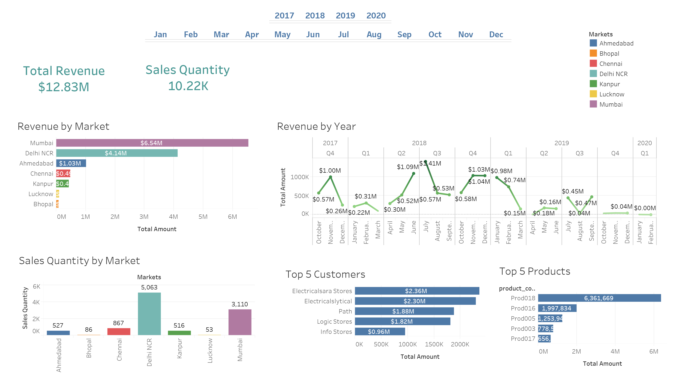

# 📊 Techcom Technologies Sales Analysis Insights

## 🛠 Data Quality Issues
The report contains several **data inconsistencies and formatting problems** that make analysis challenging:

- **Inconsistent units:** Mixing of "K" (thousands), "M" (millions), and raw numbers without clear standardization.
- **Duplicate sections:** Multiple "Sales Quantity by Market" tables with conflicting data.
- **Missing data:** No data for **2019**, and some tables have incomplete or unclear headers.
- **Formatting errors:** Apparent **copy-paste issues** in the "Total Amount" rows with repeating values.

## 📈 Observable Trends
Despite the **data quality issues**, some patterns emerge:

### 🔹 Revenue Growth
- **Total revenue** reported as **$12.83M**, but individual entries show much higher values (**e.g., $51.004M**).
- Potential **significant growth** from **2017 ($10,000K) to later years (values in millions)**.

### 🔹 Customer Analysis
- **Top customers** show values in the **$50M+ range** (**Electricalars Store, Electricaltylist, etc.**).
- "Production" appears frequently in customer data, possibly indicating a **key industry segment**.

### 🔹 Seasonality
- The **monthly breakdown** shows **consistent values across months** (**$50.334M repeating**), suggesting either **data errors** or extremely **stable sales**.

## 🛠 Recommendations

### ✅ Data Cleaning
- **Standardize all monetary values** to one unit (**preferably millions**).
- **Resolve duplicate tables** and conflicting entries.
- Investigate the repeating **$50.334M** values for potential **data entry errors**.

### 📊 Additional Analysis Needed
- **Verify the accuracy** of the **$12.83M total revenue** against the detailed numbers.
- **Examine why 2019 data is missing**.
- **Investigate the "Production" category** in customer data.

### 📉 Visualization Improvements
- The **current table format makes trend analysis difficult**.
- **Recommend adding time series charts** for revenue trends.
- **Create clear customer segmentation visualizations**.

## 🚀 Next Steps
The **most critical next step** is to **validate the data quality** before drawing firm conclusions, as the current inconsistencies make **reliable analysis difficult**. The presence of **duplicate tables and repeating values** suggests potential **errors in the underlying data or export process**.
